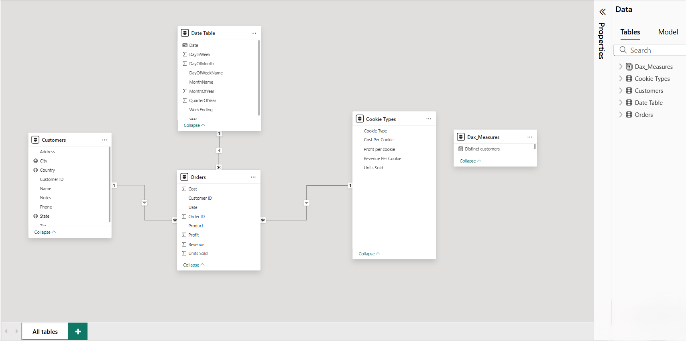

# KELVIN COOKIES 
## Introduction 
The following dataset was gotten from a cookie company named Kevin Cookies.
This company was facing a lot of losses in sales, hence they needed help to uncover the root cause of the problem.
This analysis dives into sales, profit, customer behavior, and order trends to answer key questions and uncover hidden gaps.
The goal is to help Kevin Cookies make smarter decisions and turn those losses into real growth.
## Dataset And Data Sourcing
The dataset that was gotten consist of the following tables:
Cookie types contain 5 COLUMNS and 6 ROWS
Customer table, it contains 9 COLUMNS and 5 ROWS
Date table, contains 9 COLUMNS and 457 ROWS
Orders table, contains 8 COLUMNS and 700 ROWS

### NOTE:
_The dataset used in this project is entirely fictional and created solely for demonstration purposes. It does not represent any real company, organization, or individual. The content is intended to showcase the data visualization and analytical capabilities of Power BI._

## Skills / Concept Demonstrated 
The following Power BI features incorporated includes; DAX, quick measures, modelling and page navigation.

__PowerBI Concept Applied__
__DAX Concept__: Calculated Columns and Measures, Aggregation Functions.

__Data Modeling__: Many to one (* :1)

## Problem Statement
__KPIs__
1. How many cookies were sold by the company?
2. How many orders did the company have?
3. How many distinct customers does the company have?
4. What is the total number of cookies sold?  
5. What was the total profit of the company?
6. What is the profit margin of the company?
   
__Cookie Analysis__
1. What is the total profit by cookie type?
2. What is the count of orders by cookie type?
3. What is the total number of cookies sold by cookie type?
4. What is the profit margin by cookie type?
   
__Customer Analysis__
1. What is the total profit by name of customer?
2. What is the total profit by city?
3. What is the total profit by state? (Use a shape map)
   
__Order Analysis__
1. What quarter has more orders?
2. What month has more orders?
3. What day of the week has more orders?

## Data Transformation and Cleaning.
The data was effectively cleaned and transformed with Power Query Editor in Power BI and some of the applied steps included:

- Data types from the cookies table, customers table and the orders table was adjusted from numbers to text format and from text to numbers accordingly
- A calendar table was created to efficiently track and analyse the orders table.
  
## Data Modeling
The model used here is a star schema. It contains one fact table and 3 dimensional table which is connected with one to many relationships.

## Visualization
The following report comprises of 3 pages;
- The overview page which contains the KPIs and the cookie analysis
- Customer analysis
- Order analysis
-
